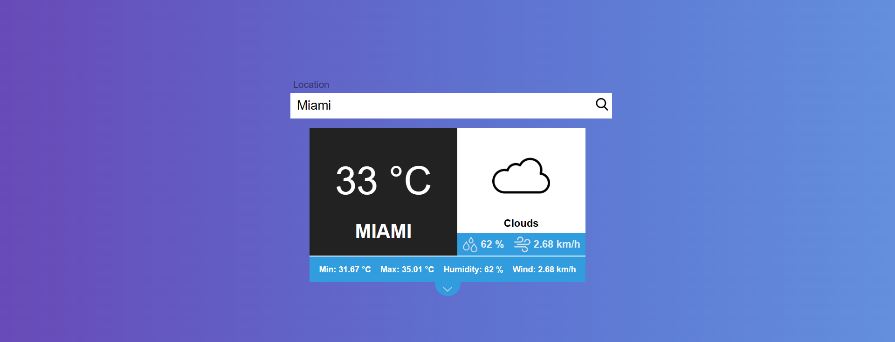

# Weather App Built with Javascript

## Description
A simple weather app built with <b>JavaScript </b>Vanilla, <b>HTML</b>, and <b>CSS</b>.The app fetches weather data from the OpenWeatherMap API and displays various weather details, such as temperature, weather description, humidity, and wind speed.

  

## Features

* <b>City Search</b> : Users can enter the name of any city in the search box and get real-time weather data for that location.

* <b>Weather Details</b>: The app displays essential weather details, such as temperature, weather description (e.g., sunny, rainy), humidity percentage, and wind speed.

* <b>Day-Night Mode:</b> The image of the app changes between day and night modes based on the current time and weather condition.

## How to Use 

<b>1.</b> Clone the repository to your local machine.
<b>2.</b> Open `index.html` in your web browser.
<b>3.</b> In the text input box, enter the name of the city for which you want to check the weather.
<b>4.</b> Click the search button or press "Enter" to fetch and display the weather data.

